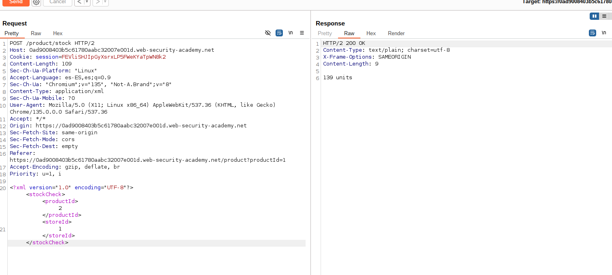
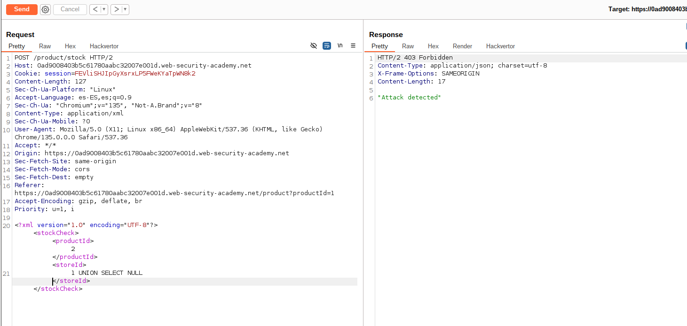
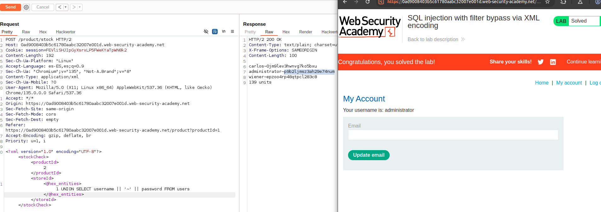

## SQL Injection

This lab contains a SQL injection vulnerability in its stock check feature. 
The results from the query are returned in the application's response, so you can use a UNION attack to retrieve data from other tables.

The database contains a users table, which contains the usernames and passwords of registered users. 
To solve the lab, perform a SQL injection attack to retrieve the admin user's credentials, then log in to their account.

`A web application firewall (WAF) will block requests that contain obvious signs of a SQL injection attack. You'll need to find a way to obfuscate your malicious query to bypass this filter. We recommend using the Hackvertor extension to do this.`

### Lab: SQL injection with filter bypass via XML encoding

Identify the vulnerability
```
Observe that the stock check feature sends the productId and storeId to the application in XML format.

Send the POST /product/stock request to Burp Repeater.

In Burp Repeater, probe the storeId to see whether your input is evaluated. 
For example, try replacing the ID with mathematical expressions that evaluate to other potential IDs, for example:

<storeId>1+1</storeId>
Observe that your input appears to be evaluated by the application, returning the stock for different stores.
```

```
Try determining the number of columns returned by the original query by appending a UNION SELECT statement to the original store ID:

<storeId>1 UNION SELECT NULL</storeId>
Observe that your request has been blocked due to being flagged as a potential attack.
```


Bypass the WAF
```
As you're injecting into XML, try obfuscating your payload using XML entities. 
One way to do this is using the Hackvertor extension. Just highlight your input, right-click, then select Extensions > Hackvertor > Encode > dec_entities/hex_entities.

Resend the request and notice that you now receive a normal response from the application. 
This suggests that you have successfully bypassed the WAF.
```
Craft an exploit
```
Pick up where you left off, and deduce that the query returns a single column. 
When you try to return more than one column, the application returns 0 units, implying an error.

As you can only return one column, you need to concatenate the returned usernames and passwords, for example:

<storeId><@hex_entities>1 UNION SELECT username || '~' || password FROM users</@hex_entities></storeId>

Send this query and observe that you've successfully fetched the usernames and passwords from the database, separated by a ~ character.

Use the administrator's credentials to log in and solve the lab.
```


[Index](../index.html)